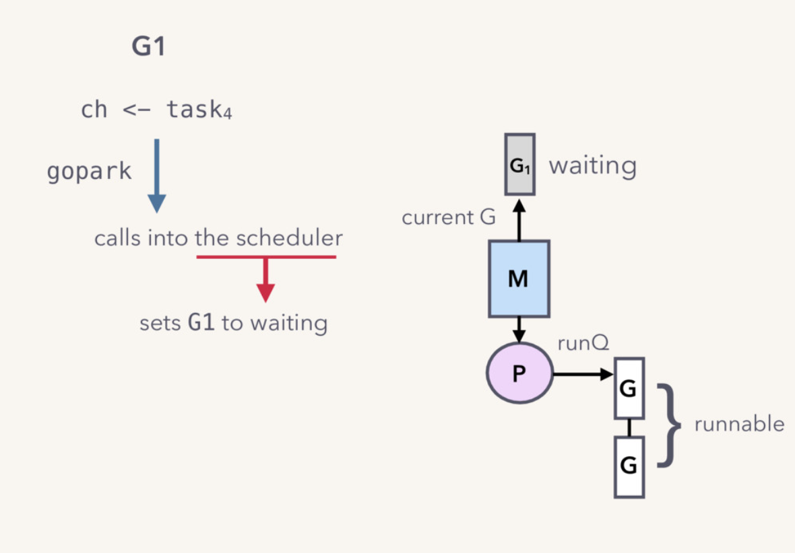

# go channel

[toc]

**go并发特性**

- goroutines
  - 独立的执行子任务，甚至是并发的执行
- channels
  - goruoutines之间通信和同步

**一个事例**


**channel的特性**

- goroutine-safe
- goroutines之间存储和传递数据
- 提供FIFO功能
- 可以引起goroutines阻塞和取消阻塞

## 创建chan

- buffered channel

```go
ch := make(chan Task, 3)
```

- Unbuffered channel

```go
ch := make(chan int)
```


make chan返回一个heap中hchan结构体的地址。

## 发送接收过程


上面一段代码展示G1向taskCh中发送数据，G2从taskCh中获取数据。

**向taskCh中加入任务的过程**

- 第一步，申请lock


- 第二步，将task0拷贝到buf中


- 第三步，释放lock


**从taskCh中取出任务的过程**

- 第一步，G2申请lock


- 第二步，从buf中取出task0


- 第三步，释放lock


整个数据的存储过程中，除了hchan是共享的，没有其他的共享内存。数据在不同的gorutines之间传递都是通过copies实现。

("Do not communicate by sharing memory; instead share memory by communicating.")

**taskCh被占满之后的阻塞过程**

- 第一步，调用gopark，将G1设置为waiting状态



- 第二步，解除G1和M的关联关系


- 第三步，从P队列中取出一个runnable的Gorutine，放到M上执行


Ps：阻塞的是Gorutine，而不是OS thread

**taskCh可用之后的唤醒过程**

- 第一步，调用goready，将G1的状态设置为runnable


- 第二步，将G1加入runQ队列


## sudog数据结构

发送者gorutines和接收者gorutines在waiting list中使用sudog数据结构存储。


G1被阻塞之后，会为自己创建sudog，放到sendq的waiting list中，task4保存在elem中。

### direct send特性


G2被唤醒时，不需要再去申请lock，也不用操作buf。

Unbuffered channel充分利用了direct send的特性。

## 设计哲学

- 简洁性
  - queue with a lock vs lock-free implementation
- 性能
  - OS thread一直非阻塞的
  - cross-goroutine栈读写
    - goroutine 唤醒路径是lockless
    - 更少的内存拷贝

### 参考文档

https://mp.weixin.qq.com/s/piU5jHJywZZq1REglZb76w

https://speakerdeck.com/kavya719/understanding-channels