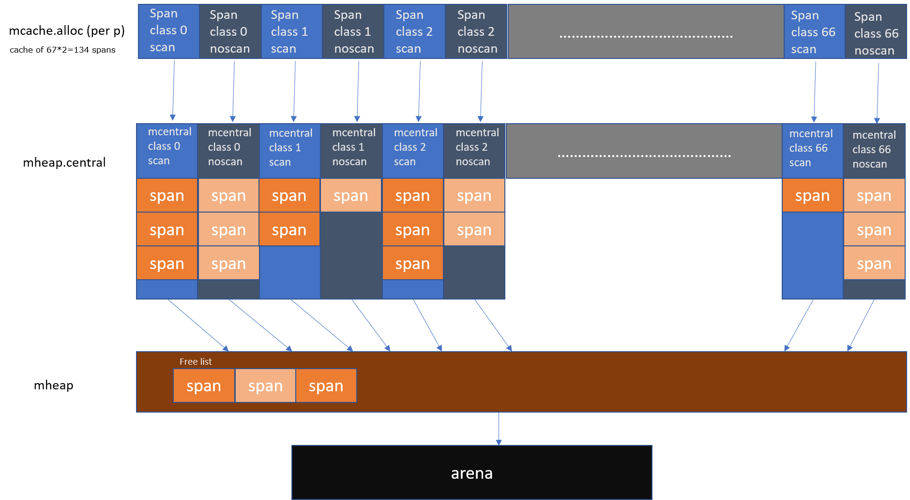
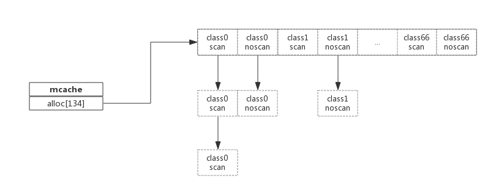

# go memory

## 前言

了解go memory之前，需要有一定的预备知识，比如物理内存和虚拟内存的概念以及区别。了解业内比较出名的内存分配器，比如glibc提供的ptmalloc2，Google的tcmalloc以及Facebook提供的jemalloc，后面二者在避免内存碎片和性能上均比glibc有较大的优势，在多线程环境中尤为明显。

Golang中也实现了内存分配器，原理与tcmalloc类似，简单的说就是维护一块大的全局内存，每个线程(Golang中为P)维护一块小的私有内存，私有内存不足再从全局申请。核心思想是将**内存分解为多层**，从而**减小内存锁的粒度**。

## 基础概念


预申请的内存划分为**spans、bitmap、arena**三部分。其中arena即为所谓的堆区，应用中需要的内存从这里分配。其中spans和bitmap是为了管理arena区而存在的。

- arena

arena的大小为512G，为了方便管理把arena区域划分成一个个的page，每个page为8KB,一共有512GB/8KB个页。

- spans

spans区域存放span的指针，每个指针对应一个page，所以span区域的大小为(512GB/8KB)*指针大小8byte = 512M。

- bitmap


go内存示意图：




### span

span是内存管理的**基本单位**,每个span用于管理特定的class对象, 跟据对象大小，span将一个或多个页拆分成多个块进行管理。

```go
type mspan struct {
	next *mspan			//链表前向指针，用于将span链接起来
	prev *mspan			//链表前向指针，用于将span链接起来
	startAddr uintptr // 起始地址，也即所管理页的地址
	npages    uintptr // 管理的页数
	
	nelems uintptr // 块个数，也即有多少个块可供分配

	allocBits  *gcBits //分配位图，每一位代表一个块是否已分配

	allocCount  uint16     // 已分配块的个数
	spanclass   spanClass  // class表中的class ID

	elemsize    uintptr    // class表中的对象大小，也即块大小
}
```

以class 10为例，span管理的内存如下图所示： 


spanclass为10，参照class表可得出npages=1,nelems=56,elemsize为144。其中startAddr是在span初始化时就指定了某个页的地址。allocBits指向一个位图，每位代表一个块是否被分配，本例中有两个块已经被分配，其allocCount也为2。

### mcache

有了管理内存的基本单位span，还要有个数据结构来管理span，这个数据结构叫mcentral，各线程(Golang中的P)需要内存时从mcentral管理的span中申请内存，为了避免多线程申请内存时不断的加锁，Golang为每个线程（P）分配了span的缓存，这个缓存即是mcache。



**mcache**在初始化的时候是没有任何**span**，在使用的过程中动态的葱**mcentral**中获取并且缓存下来，根据使用的情况，每种类型的**span**个数也不相同。

### mcentral

**mcache**作为线程的私有资源为单个线程服务，而**mcentral**则是全局资源，为多个线程服务，当某个线程内存不足时会向**mcentral**申请，当某个线程释放内存时又会回收进**mcentral**，申请和释放的过程都会加锁。

```go
type mcentral struct {
	lock      mutex     //互斥锁
	spanclass spanClass // span class ID
	nonempty  mSpanList // non-empty 指还有空闲块的span列表
	empty     mSpanList // 指没有空闲块的span列表

	nmalloc uint64      // 已累计分配的对象个数
}
```

### mheap

从**mcentral**数据结构可见，每个**mcentral**对象只管理特定的class规格的**span**。事实上每种class都会对应一个**mcentral**,这个**mcentral**的集合存放于**mheap**数据结构中。

```go
type mheap struct {
	lock      mutex

	spans []*mspan

	bitmap        uintptr 	//指向bitmap首地址，bitmap是从高地址向低地址增长的

	arena_start uintptr		//指示arena区首地址
	arena_used  uintptr		//指示arena区已使用地址位置

	central [67*2]struct {
		mcentral mcentral
		pad      [sys.CacheLineSize - unsafe.Sizeof(mcentral{})%sys.CacheLineSize]byte
	}
}
```

**mheap**内存管理示意图如下：


系统预分配的内存分为spans、bitmap、arean三个区域，通过mheap管理起来。

## 内存分配过程

malloc.go


### 总结

Golang内存分配是个相当复杂的过程，其中还掺杂了GC的处理，这里仅仅对其关键数据结构进行了说明，了解其原理而又不至于深陷实现细节。

1. Golang程序启动时申请一大块内存，并划分成spans、bitmap、arena区域
2. arena区域按页划分成一个个小块
3. span管理一个或多个页
4. mcentral管理多个span供线程申请使用
5. mcache作为线程私有资源，资源来源于mcentral

## GC过程

Golang GC改进版本：

- v1.1 STW
- v1.3 Mark STW, Sweep 并行
- v1.5 三色标记法
- v1.8 hybrid write barrier

### 何时触发GC

- 在堆上分配大于32K bytes对象的时候检查此时是否满足垃圾回收的条件，如果满足则进行垃圾回收。
- 

## 参考文档

https://zhuanlan.zhihu.com/p/29216091

https://www.infoq.cn/article/IEhRLwmmIM7-11RYaLHR

https://my.oschina.net/renhc/blog/2236782?spm=a2c4e.11153940.blogcont652551.13.3e3f2219VGYgD9

https://yq.aliyun.com/articles/652551

https://blog.learngoprogramming.com/a-visual-guide-to-golang-memory-allocator-from-ground-up-e132258453ed

