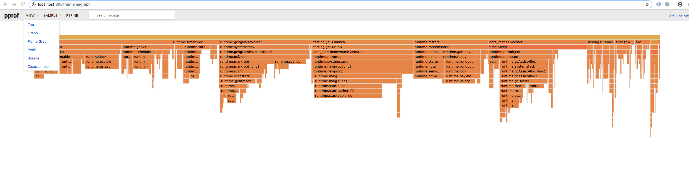
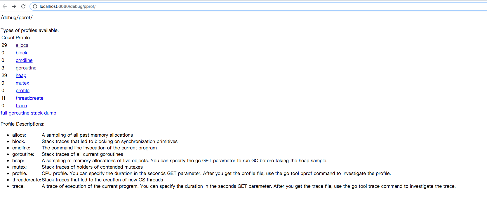
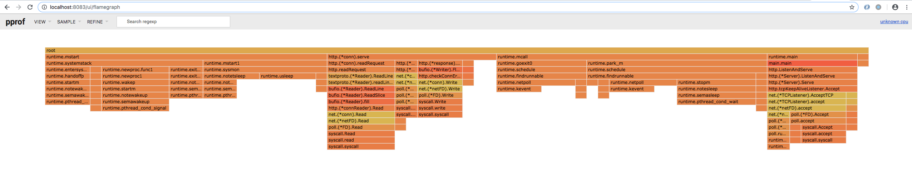

# go tool pprof 生成火焰图

从go 1.11开始，go tool pprof已经原生支持生成代码执行的火焰图。

```go
# This will listen on :8081 and open a browser.
# Change :8081 to a port of your choice.
$ go tool pprof -http=":8081" [binary] [profile]
```

对于go tool 1.11以前的版本，可以使用uber开源的go-torch工具支持（不推荐），或者在不能升级go版本的情况下，可以单独升级go tool pprof工具（推荐）：

```go
# Get the pprof tool directly
$ go get -u github.com/google/pprof

$ pprof -http=":8081" [binary] [profile]
```

## 准备一个demo

```go
func BenchmarkGoroutine(b *testing.B) {
	var ff f
	b.StartTimer()
	for i := 0; i < b.N; i++ {
		for j := 0; j < RunTimes; j++ {
			go ff.Executor()
		}
	}
	b.StopTimer()
}
```

这个benchmark是关于goroutine pool对比测试中的例子，循环调用一个Executor的函数。

## 产生一个profile文件

> go test -bench=BenchmarkGoroutine -benchmem=true  -memprofile memprofile_goroutine.out -cpuprofile profile_goroutine.out

使用 go test -bench -cpuprofile 生成profile文件。

## 生成火焰图

> go tool pprof -http=":8081" profile_goroutine.out 

使用 go tool pprof -http命令会打开浏览器，将结果可视化。



## 生成http服务的火焰图

### 准备一个http服务

```go
package main

import (
	"fmt"
	"html"
	"log"
	"net/http"
	_ "net/http/pprof"
)


func main() {
	http.HandleFunc("/bar", func(w http.ResponseWriter, r *http.Request) {
		fmt.Fprintf(w, "Hello, %q", html.EscapeString(r.URL.Path))
	})

	log.Println(http.ListenAndServe("localhost:6060", nil))
}
```

### 模拟请求

首先启动服务，模拟请求

```shell
for ((i=1; i<=100000000000; i ++))  
do  
    curl 127.0.0.1:6060/bar  
done  
```

### 请求profile

>  http://localhost:6060/debug/pprof/



下载profile后，使用go tool pprof分析

> go tool pprof -http=":8083" ~/Downloads/profile

